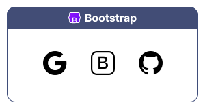
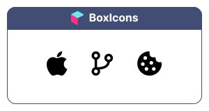
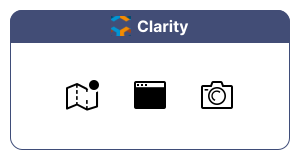
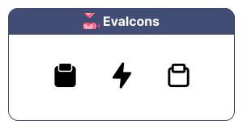
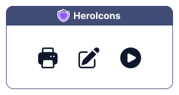
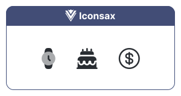
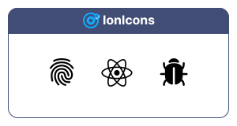
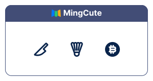

# Super Icons

Super Icons is an icon package that provides a curated selection of high-quality icon packs to accelerate UI development.

## List of Icon packs
Here is the list of icon packs in the package.

1. [Bootstrap](#bootstrap)
2. [BoxIcons](#boxicons)
3. [Clarity](#clarity)
4. [EvaIcons](#evaicons)
5. [HeroIcons](#heroicons)
6. [Iconsax](#iconsax)
7. [IonIcons](#ionicons)
8. [Lucide]
9. [MingCute](#mingcute)
10. [PelaIcons]

## Example Usage

### Bootstrap



```dart
  Icon(SuperIcons.bs_google),
  Icon(SuperIcons.bs_bootstrap),
  Icon(SuperIcons.bs_github),
```

### BoxIcons



```dart
  Icon(SuperIcons.bx_apple),
  Icon(SuperIcons.bx_git_branch),
  Icon(SuperIcons.bx_cookie),
```

### Clarity



```dart
  Icon(SuperIcons.cl_map_outline_badged),
  Icon(SuperIcons.cl_application_solid),
  Icon(SuperIcons.cl_camera_line),
```

### EvaIcons



```dart
  Icon(SuperIcons.ev_clipboard),
  Icon(SuperIcons.ev_flash),
  Icon(SuperIcons.ev_clipboard_outline),
```

### HeroIcons



```dart
  Icon(SuperIcons.hr_printer),
  Icon(SuperIcons.hr_pencil_square),
  Icon(SuperIcons.hr_play_circle),
```

### Iconsax



```dart
  Icon(SuperIcons.is_cake_bold),
  Icon(SuperIcons.is_clock_bulk),
  Icon(SuperIcons.is_dollar_circle_outline),
```

### IonIcons



```dart
  Icon(SuperIcons.ii_bug),
  Icon(SuperIcons.ii_finger_print),
  Icon(SuperIcons.ii_logo_react),
```

### MingCute



```dart
  Icon(SuperIcons.mg_knife_line),
  Icon(SuperIcons.mg_badminton_line),
  Icon(SuperIcons.mg_currency_bitcoin_fill),
```
